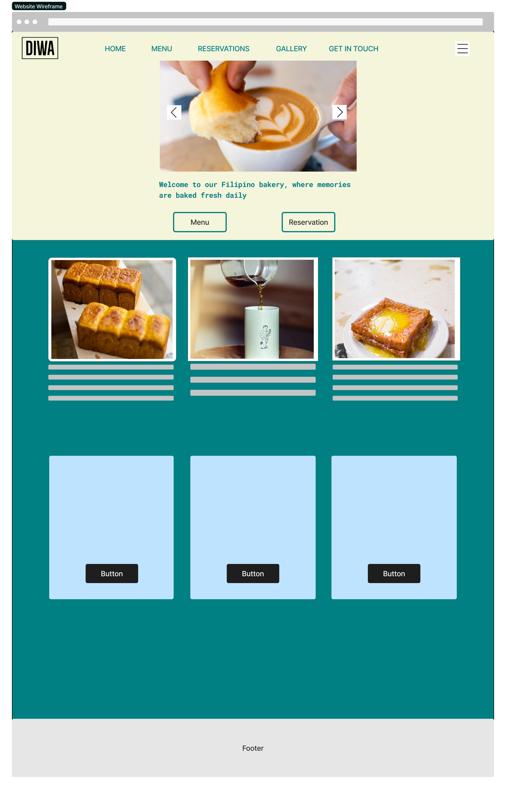

# [Diwa](https://discoveren.github.io/diwa-bakery/)

Welcome to Diwa, a culinary haven in London where we invite you to embark on a flavourful journey through the Philippines, showcasing traditional dishes crafted with passion and authenticity.

This project was created using HTML, CSS and JavaScript.

## Table of Contents
<ol>
<li><a href="#user-experience">User Experience</a></li>
    <ul>
    <li><a href="#user-stories">User Stories</a></li>
    </ul>
<li><a href="#design">Design</a></li>
<ul>
<li><a href="#wireframes">Wireframes</a></li>
<li><a href="#colours">Colours</a></li>
<li><a href="#website-idea">Website Idea</a></li>
</ul>
<li><a href="#features">Features</a></li>
<li><a href="#technologies">Technologies</a></li>
<li><a href="#testing">Testing</a></li>
<li><a href="#future-features">Future Features</a></li>

## User Experience

### User Stories

#### I. User interested in exploring Filipino cuisine in London:

<ul>
<li>As a food enthusiast, I want to discover the menu options available at the Filipino restaurant, so I can experience the culture through food.</li>
<li>As a diner curious about Filipino cuisine, I want to learn about the traditional dishes served at the restaurant and their cultural significance.</li>
</ul>

#### II. Filipino expatriate seeking a taste of home:

<ul>
<li>As a Filipino living abroad, I want to find a restaurant in London that offers authentic Filipino dishes, reminiscing of the flavours from back home.</li>
<li>As someone longing for the comfort of Filipino food, I want to know if the restaurant offers specific regional specialties or familiar favourites.</li>
</ul>

#### III. Local resident interested in trying something new:

<ul>
<li>As a London resident, I'm intrigued by the idea of trying Filipino cuisine for the first time with family and friends.</li>
<li>As someone looking for a unique dining experience in London, I want to know if the restaurant incorporates any modern twists or innovative dishes alongside traditional Filipino fare.</li>
</ul>

## Design

### Wireframes

### Home Page and main section mockup

### Colours

### Website Idea

Initially, it was meant to be a filipino bakery/cafe because I was inspired by the bakeries' back home in the Philippines. However, while making the website it evolved into a restaurant because I think elevating it into a restaurant could help push filipino cuisine into a wider audience. Which then leads back to the name of the restaurant which is 'Diwa' which translate for 'Soul'.

## Features

### Home Page

The purpose of the home page is to provide the user with the overview content of the website's content.

### Menu

The purpose of the menu page is to provide the user with the food selection of the restaurant.

### Gallery

The purpose of the gallery page is to provide the user with the food images of the restaurant.

### Contact

The purpose of the contact page is for the user to get in touch with restaurant regarding any query or suggestions.

## Technologies

- [HTML](https://web.dev/learn/html/overview/): Provided structure and semantic elements for content.
- [CSS](https://developer.mozilla.org/en-US/docs/Web/CSS): Styled HTML elements for improved visual presentation.
- [JavaScript](https://developer.mozilla.org/en-US/docs/Web/JavaScript): Integrated to add google maps api to the website.
- [GitHub](https://github.com/): Hosted the code repository for the website.
- [Git](https://git-scm.com/): Managed version control and code updates.
- [Google Fonts](https://fonts.google.com/): Imported fonts for enhanced typography.
- [Google Chrome Lighthouse](https://developer.chrome.com/docs/lighthouse/overview/): Tested and assessed website performance, accessibility, SEO, and best practices.
- [Google Chrome Developer Tools](https://developer.chrome.com/docs/devtools/overview/): Used for testing, debugging, and ensuring responsiveness.
- [W3C HTML Validator](https://validator.w3.org/nu/): Validated HTML code for errors and compliance with standards.
- [W3C CSS Validator](https://jigsaw.w3.org/css-validator/): Validated CSS code for errors and compliance with standards.

## Testing

### HTML Validation

Home Page

Menu Page

Gallery Page

Contact Page

### CSS Validation

### Lighthouse Reports

Home Page

Menu Page

Gallery Page

Contact Page

## Future Features

<ul>
    <li>Store page where a user can order for collection or delivery.</li>
    <li>Working carousel with JavaScript implementation.</li>
    <li>Loyalty scheme so everytime a user order it adds a tally and provide bonuses depending on the amount of orders.</li>
</ul>

